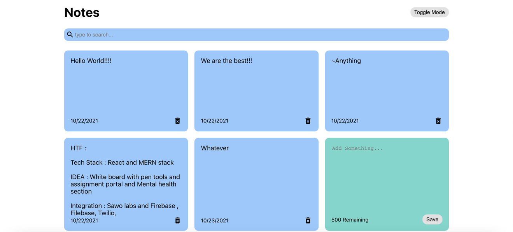

# Notifi-me
A Basic react js application built for creating your clickbait notes and notify you for your upcoming events as well.

## Live Preview :

Here, We Have a Toggle Button at the top right for Dark mode Experience to the user according to their perference. You can create as many notes under the limit of 500 words and then save it. Later, If ou feel like deleting the note you can click on the bin placed at the bottom left of the note. when ou are done with the note you can click on the save button to save it and you'll recieve a pop up for adding another note.
<br><br>

# Installing : 

- Clone the repo to make it available on your local system by using ```git clone <FORKED_REPO_URL>```
- cd into the project directory i.e  - ```cd Notifi-me```

<br>

# Run The App in your Local System :

- Once you've created a local repository for the forked project you can open a new terminal and run the command 
```
npm i
``` 
This installs the necessary dependencies in your local machine.

- Once the dependencies are succesfully installed you can run this command 
```
npm start
```
to initiate the Notifi-me app on your local server.

<br>

# We are open for your valuable contributions :

- We are Open for Pull Requests
- Please contribute and add value to the code
- If you have some ideas for new features and you don't have time to implement them please open an issue with the tag new_feature.
- Please don't forget to comment (document) your code!
- Also If you feel like developing or working out on the Documentation section of this repository make sure to raise an issue.
- Before creating a Pull Request please go through the above guidelines and the code!


